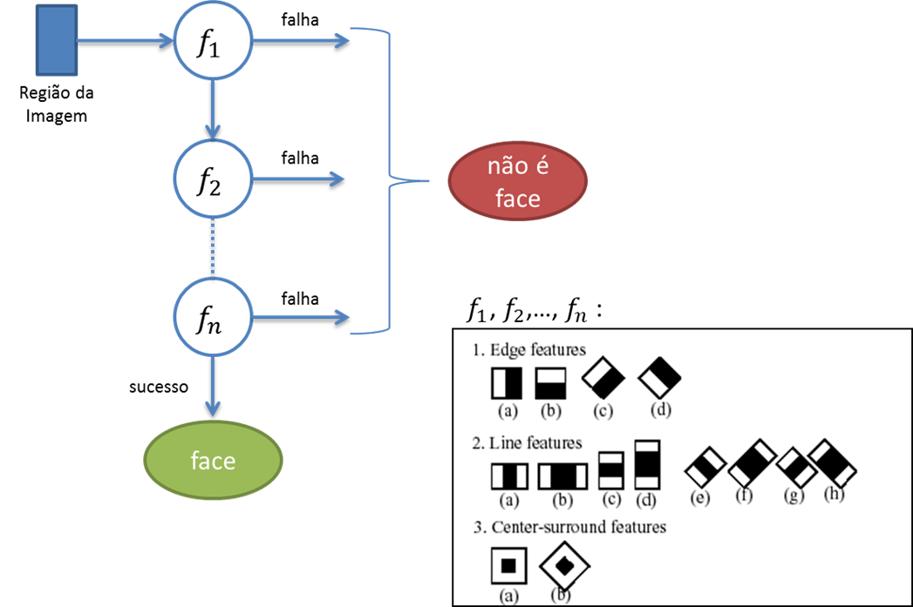
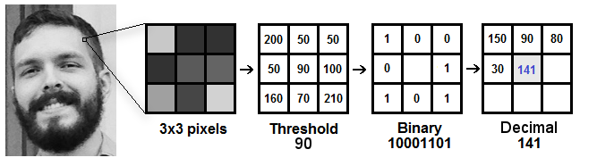
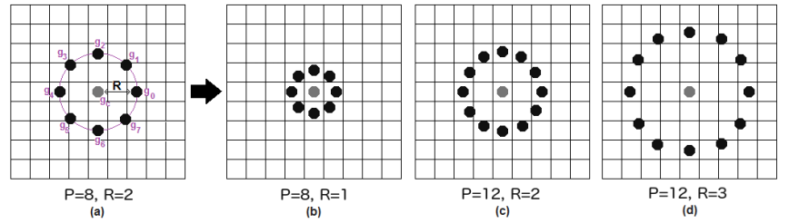
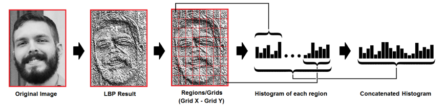

# Reconhecimento Facial

## Principais conceitos

- Identificação e verificação de pessoas em fotografias e vídeos;
- O processo de reconhecimento passa por diversas etapas:
  - Detecção;
  - Alinhamento;
  - Limpeza;
  - Extração de features;
  - Reconhecimento.

## Etapas do recohencimento

- Detecção de faces:
  - Utilização de técnicas para marcação das fronteiras (bounding box);  
  - Alinhamento, normalização com verificação de: 
    -  Ângulo;
    -  Rotação;
    -  Posições.
- Extração de features:
   - Identificar carecterísticas da face através de pontos e distancias.
- Reconhecimento:
  - Identificar a pessoa em uma imagem ou vídeo.

## Algoritmo Cascade

Cascade (cascata, em português) ou Haar Cascade é o "apelido" de um famoso algoritmo de busca de objetos em imagens, cujo nome oficial é Algoritmo de Viola-Jones (devido aos nomes dos autores).

Esse algoritmo utiliza máscaras (as chamadas Haar Features) para caracterizar um objeto por meio de variações de luminosidade (principalmente em bordas). As máscaras capturam essas variações em diferentes amplitudes e direções, e os valores que caracterizam um certo tipo de objeto (uma face inteira ou só um olho, por exemplo) são aprendidas com um algoritmo de aprendizagem de máquina chamado AdaBoost para gerar vários classificadores, um para cada Haar Feature. Uma vez que esses classificadores são produzidos - isto é, treinados a partir de imagens de exemplo (no caso do Cascade, com imagens positivas - que têm o objeto - e negativas - que não têm o objeto), ele encontra o objeto em uma nova imagem executando os vários mini classificadores "em cascata" (e daí o apelido do algoritmo):

- O algoritmo define um tamanho de janela, escala as Haar Features para esse tamanho, e varre a imagem sendo buscada segundo essa janela. (É muito mais eficiente escalar as features do que a imagem, até porque as features já podem ser mantidas pré-escaladas).
- Em cada janela, o algoritmo seleciona e executa um dos mini classificadores (para uma dada feature) com base nos valores de pixel na imagem sob aquela janela.
- Se a feature retorna falso (isto é, não é o objeto do ponto de vista dela), o algoritmo segue para a próxima janela. Se acabaram as janelas, ele conclui que não tem o objeto procurado na imagem.
- Se a feature retorna true (isto é, é o objeto do ponto de vista dela), o algoritmo passa para o próximo classificador e repete a partir do passo 2. Se não há mais mini classificadores para executar, o algoritmo conclui pois encontrou o objeto naquela janela.

A imagem a seguir ilustra esse processo no detector de faces do OpenCV (as features são reproduzidas da página do OpenCV).

O uso do AdaBoost é importante por desempenho, já que esse algoritmo procura iterativamente na imagem com janelas de vários tamanhos. Por isso ele é capaz de encontrar objetos com bastante robustez em diferentes escalas (isto é, com diferentes tamanhos). Um ponto importante é que a sua acurácia em encontrar objetos depende fortemente das imagens utilizadas no treinamento. Se forem utilizadas imagens com o objeto em apenas uma orientação no treinamento, o algoritmo não será capaz de identificar o objeto em outras orientações (por exemplo, um algoritmo de detecção de bananas treinado com bananas na horizontal não irá reconhecê-las em qualquer outra orientação além dessa).

## Local Binary Pattern (LBP)

Local Binary Pattern (LBP) é um operador de textura simples, porém eficiente, que rotula os pixels de uma imagem ao limitar a vizinhança de cada pixel e considera o resultado como um número binário.

Foi descrito pela primeira vez em 1994 (LBP) e, desde então, foi considerado um recurso poderoso para a classificação de textura. Ainda, quando o LBP é combinado com os histograms of oriented gradients (HOG), ele melhora o desempenho da detecção consideravelmente em alguns conjuntos de dados.

Usando o LBP combinado com histogramas, podemos representar as imagens do rosto como um vetor de dados simples.

Como o LBP é um descritor visual, ele também pode ser usado para tarefas de reconhecimento facial, como pode ser visto na seguinte explicação.

Agora que sabemos um pouco mais sobre o reconhecimento facial e o LBPH, vamos mais longe e vejamos as etapas do algoritmo:

1. Parâmetros: o LBPH usa 4 parâmetros:

    - Raio: o raio é usado para construir o padrão binário circular e representa o raio ao redor do pixel central. Geralmente, é definido como 1.
    - Vizinhos: o número de pontos de amostra para construir o padrão binário circular local. Tenha em mente que: quanto mais pontos de amostra você incluir, maior será o custo computacional. Geralmente é definido como 8.
    - Grade X: o número de células na direção horizontal. Quanto mais células mais fina é a grade e maior é a dimensionalidade do vetor de características resultante. Geralmente é definido como 8.
    - Grade Y: o número de células na direção vertical. Quanto mais células, mais fina é a grade e maior é a dimensionalidade do vetor de características resultante. Geralmente é definido como 8.
    Não se preocupe com os parâmetros no momento, você os entenderá depois de ler os próximos passos.

2. Treinando o Algoritmo: Primeiro, precisamos treinar o algoritmo. Para fazer isso, precisamos usar um conjunto de dados com as imagens faciais das pessoas que queremos reconhecer. Nós também precisamos definir um ID (pode ser um número ou o nome da pessoa) para cada imagem, então o algoritmo usará essas informações para reconhecer uma imagem de entrada e dar-lhe uma saída. Imagens da mesma pessoa devem ter o mesmo ID. Com o conjunto de treinamento já construído, vejamos os passos computacionais do LBPH.

3. Aplicando a operação LBP: O primeiro passo computacional do LBPH é criar uma imagem intermediária que descreva melhor a imagem original, destacando as características faciais. Para fazer isso, o algoritmo usa um conceito de janela deslizante, com base nos parâmetros raio e vizinhos.

A imagem abaixo mostra esse procedimento:

Com base na imagem acima, vamos dividir em várias pequenas etapas para que possamos entender isso facilmente:

- Suponha que tenhamos uma imagem facial em escala de cinza.
- Podemos obter parte desta imagem como uma janela de 3×3 pixels.
- Ele também pode ser representado como uma matriz 3×3 contendo a intensidade de cada pixel (0 ~ 255).
- Então, precisamos tomar o valor central da matriz para ser usado como limiar.
- Esse valor será usado para definir os novos valores dos 8 vizinhos.
- Para cada vizinho do valor central (limiar), estabelecemos um novo valor binário.
- Definimos 1 para valores iguais ou superiores aolimiar e 0 para valores inferiores aolimiar.
- Agora, a matriz conterá apenas valores binários (ignorando o valor central).
- Precisamos concatenar cada valor binário de cada posição da matriz linha por linha para um novo valor binário (por exemplo, 10001101). Nota: alguns autores usam outras abordagens para concatenar os valores binários (por exemplo, no sentido horário), mas o resultado final será o mesmo.
- Então, convertemos esse valor binário para um valor decimal e colocamos ele na posição central da matriz, que é realmente um pixel da nova imagem.
- No final deste procedimento (chamado LBP), temos uma nova imagem que representa melhor as características da imagem original.

Nota: O procedimento LBP foi expandido para usar um número diferente de raio e vizinhos, é chamado de Circular LBP.

Isso pode ser feito usando a interpolação bilinear. Se algum ponto de dados estiver entre os pixels, ele usa os valores dos 4 pixels mais próximos (2×2) para estimar o valor do novo ponto de dados.

4. Extraindo os histogramas: agora, usando a imagem gerada no último passo, podemos usar os parâmetros Grade X e Grade Y para dividir a imagem em múltiplas grades, como pode ser visto na imagem a seguir:

Com base na imagem acima, podemos extrair o histograma de cada região da seguinte maneira:

Como temos uma imagem em escala de cinza, cada histograma (de cada grade) conterá apenas 256 posições (0 ~ 255) que representam as ocorrências de cada intensidade de pixel.
Então, precisamos concatenar cada histograma para criar um histograma novo e maior. Supondo que tenhamos redes 8×8, teremos 8x8x256 = 16.384 posições no histograma final. O histograma final representa as características da imagem original da imagem.

O algoritmo LBPH é praticamente isso.

5. Realizando o reconhecimento facial: nesta etapa, o algoritmo já está treinado. Cada histograma criado é usado para representar cada imagem do conjunto de dados de treinamento. Assim, dada uma imagem de entrada, nós executamos as etapas novamente para esta nova imagem e criamos um histograma que representa a imagem.

Então, para encontrar a imagem que corresponde à imagem de entrada, precisamos comparar dois histogramas e devolver a imagem com o histograma mais próximo.
Podemos usar várias abordagens para comparar os histogramas (calcular a distância entre dois histogramas), por exemplo: distância euclidiana, qui-quadrado, valor absoluto, etc. Neste exemplo, podemos usar a distância euclidiana (que é bastante conhecida) baseada na seguinte fórmula:

$$D = \sqrt{\sum^n_{i=1} (hist_{1i} - hist_{2i})^2}$$

Portanto, a saída do algoritmo é o ID da imagem com base no histograma mais próximo. O algoritmo também deve retornar a distância calculada, que pode ser usada como medida de "confiança". Nota: não se deixe enganar com o nome da "confiança", pois as confianças mais baixas são melhores porque significa que a distância entre os dois histogramas é mais próxima.
Podemos usar um limite e a "confiança" para estimar automaticamente se o algoritmo reconheceu corretamente a imagem. Podemos assumir que a pessoa foi reconhecida com sucesso se a confiança for menor do que um limiar definido.

[Fonte deste texto na integra](https://updatedcode.wordpress.com/2017/11/26/reconhecimento-facial-como-funciona-o-lbph/). 

## Facenet

A profunda rede convolucional do Google - FaceNet, proposta em 2015 pelos pesquisadores do Google, supera o obstáculo de implementar a verificação facial e o reconhecimento de forma eficiente em escala e alcançou resultados de última geração. Os autores nos apresentaram o conceito de embeddings harmônicos e uma perda de tripleto harmônico, que descreve diferentes versões de embeddings de faces (produzidos por redes diferentes) que são compatíveis entre si e permitem a comparação direta entre si. FaceNet é a espinha dorsal de muitos sistemas de código aberto, como FaceNet usando Tensorflow, Keras FaceNet, DeepFace, OpenFace.

Vamos começar falando sobre o que realmente é o reconhecimento de rosto.