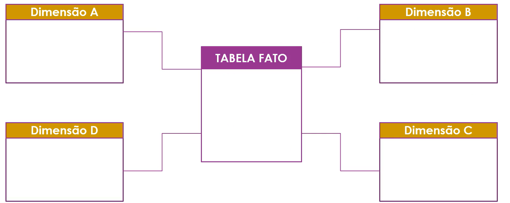
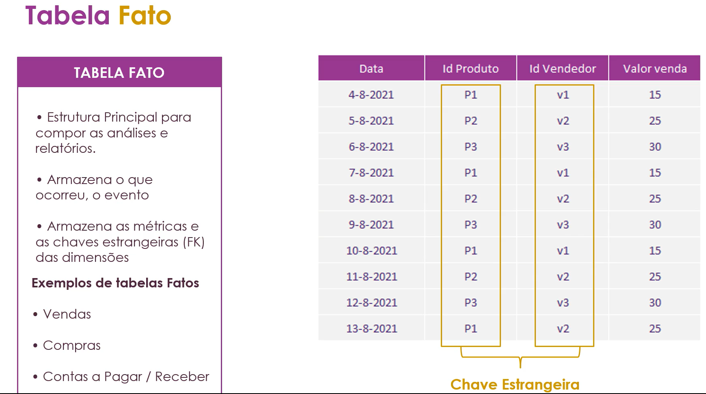
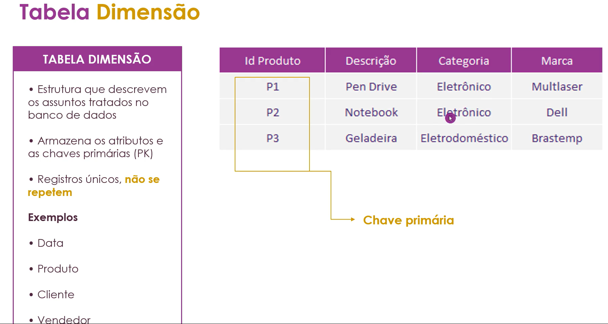
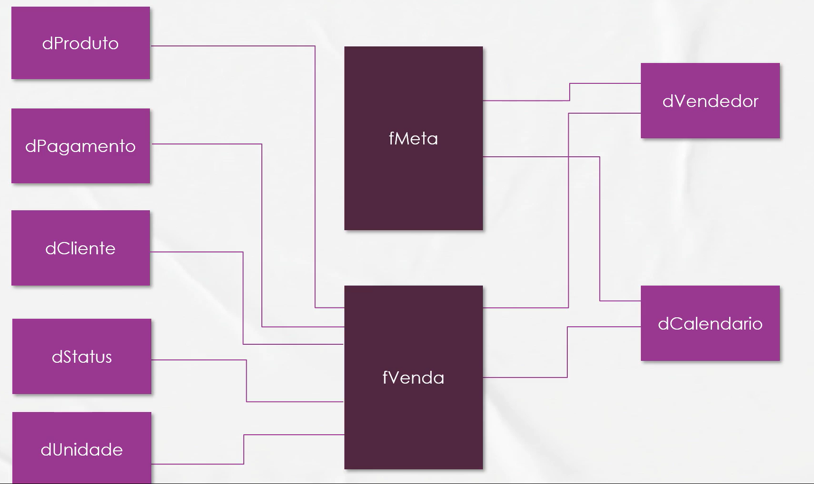

# O que é um modelo de dados? 

Estrutura lógica com **tabelas relacionadas** que representa processos de negócios. 

## Qauis os tipos de modelagem? 

|             d       | Relacional                                     | Dimensional                            |
|--------------------:|-----------------------------------------------:|----------------------------------------|
|Usado em             |Banco de Dados Relacionais                      | Repos. De Dados (DW) ou modelos PowerBI|
|Tipos de sistemas    |Transacionais - OLTP                            | Analíticos - OLAP                      |
|Nível de Organização |Operacional                                     | Tático/Estratégico                     |
|Tipo de Modelagem    |Normalizado                                     | Desnormalizado                         |
|Conceito Chave       |Entidade/Relacionamento                         | Fato e Dimensão                        |
|Foco                 |Armazen. Consistente., Inse. Alte. Delet. Dados | Consulta Rápida de Dados               |
|Ao realizar consultas|Baixo desempenho                                | Alto Desempenho                        |

1. O que é uma tabela normalizada? Imagine uma tabela de vendas e uma de produtos, a deprodutos é quebrada por uma tabela de subcategoria e a tabela de subcategoria é quebrada pela tabela categoria.  Assim o dado é divido pelas subcategorias. 
Já uma tabela desnormalizada poderiamos ter uma tabela de vendas e uma de produtos que apresenta dentro dela todas as subcategorias e categorias do produto em colunas por exemplo. 

## Como funciona a modelagem dimensional? 

### Tabela Fato

### Tabela Dimensão

Em resumo: 

Tabelas utilizadas para realizção dos **cálculos**, são as tabeals **Fatos**.

Tabelas utilizadas como **Filtro** serão **Dimensões**.

## Modelo de Dados Empregado no Estudado

