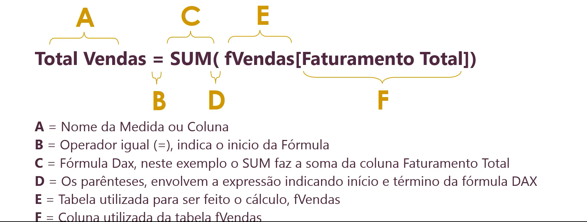

# Curso PowerBI

Author: **PhD. Wesley Lima**

## Módulo I

### O que é um modelo de dados? 

Estrutura lógica com **tabelas relacionadas** que representa processos de negócios. 

### Qauis os tipos de modelagem? 

|             d       | Relacional                                     | Dimensional                            |
|--------------------:|-----------------------------------------------:|----------------------------------------|
|Usado em             |Banco de Dados Relacionais                      | Repos. De Dados (DW) ou modelos PowerBI|
|Tipos de sistemas    |Transacionais - OLTP                            | Analíticos - OLAP                      |
|Nível de Organização |Operacional                                     | Tático/Estratégico                     |
|Tipo de Modelagem    |Normalizado                                     | Desnormalizado                         |
|Conceito Chave       |Entidade/Relacionamento                         | Fato e Dimensão                        |
|Foco                 |Armazen. Consistente., Inse. Alte. Delet. Dados | Consulta Rápida de Dados               |
|Ao realizar consultas|Baixo desempenho                                | Alto Desempenho                        |

1. O que é uma tabela normalizada? Imagine uma tabela de vendas e uma de produtos, a deprodutos é quebrada por uma tabela de subcategoria e a tabela de subcategoria é quebrada pela tabela categoria.  Assim o dado é divido pelas subcategorias. 
Já uma tabela desnormalizada poderiamos ter uma tabela de vendas e uma de produtos que apresenta dentro dela todas as subcategorias e categorias do produto em colunas por exemplo. 

### Como funciona a modelagem dimensional? 

#### Tabela Fato

#### Tabela Dimensão

Em resumo: 

Tabelas utilizadas para realizção dos **cálculos**, são as tabeals **Fatos**.

Tabelas utilizadas como **Filtro** serão **Dimensões**.

### Modelo de Dados Empregado no Estudado

## Módulo II

### Mesclagem de tabelas (Merge ou Joins)

Mesclagem de dados, merge ou joins servem para junção ou combinação de tabelas com base em um identificador comum entre as tabelas, assim extendendo a disponibilização das colunas de uma tabela em outra de particular interesse. Tipos de mesclagens:

Exemplo de uma mesclagem Externa Esquerda: 

Exemplo de uma mesclagem Interna:

## Módulo V

### Relacionamento de Tabelas

Relacionamento é a possibilidade de aplicarmos um filtro em outra tabela (fatos) a partir de atributos vindos das dimensões.

Como funciona o relacionamento entre tabelas, como podemos organizá-lo e estruturá-lo. Com base no exemplo da imagem abaixo, podemos vê que existe uma relação entre a tabela dprodutos (dimenssão) e a tabela fVendas (fato), lembrando que o a coluna **Id Produto** na tabela dimenssão é uma chave primária, logo não se repete e na tabela fato é uma chave estrangeira, sendo assim o **Id Produto** pode se repetir. Analise a imagem abaixo. 

Vamos entender os termos comuns na linha que liga as duas tabelas. O número (1 e op sinal de *) indicam a cardinalidade, isso quer dizer que na tabela dimenssão para a coluna **Id Produto** existe apenas uma correspodência enquanto que o (*) na tabelka fato indica que existem diverssas correpodência. A `seta` indica a direção, isto quer dizer que a dimenssão **dProdutos** é quem filtra a tabela **Fvendas**.  

#### Cardinalidade do Relacionamento

1. (1:N) - Um para muitos: Maneira mais atual de relacionamentos.
2. (1:1) - Um para Um: Não faz muito sentido, poderíamos tornar ambas as tabelas em apenas uma
2. (N:N) - Muitos para Muityos: Em geral é utilizado para relacionar tabelas em diferentes granularidades. permite decidir o sentido entre o relacionamento se será único ou ambos. 

#### Direção do Filtro

1. Único: Comportamento mais seguro. A propagação do filtro se faz do Lado 1 para o Lado N (Dimensão para Fatos)
2. Ambos: Conhecido como bidirecional (extremamente perigoso)

## Módulo VI

### O que é Dax

DAX (Data Analysis Expressions) é uma coleção de **funções**, **operadores** e **constantes** que podem ser usados em uma **fórmula**, ou expressão, para calcular e retornar um ou mais valores. Em resumo, o DAX ajudará você a criar novas informações de dados já existentes em seu modelo. 

### Coluna calculada x Medida

1. Medida:
    - Utilizada no campo *valores* de um gráfico
    - São computadas somente quando colocadas emn algum visual.  
2. Coluna calculada: 
    - Utilizada no campo de *eixo* dos gráficos e segmentações de dados (filtros).
    - São computadas no momento em que são criadas, sonsumindo memória.

### Sintax Dax

Uma função Dax pode retornar como resultado um Esclar (valor único), Tabela ou Coluna. 

### Funções Dax

#### SUM

Soma todos os números de uma coluna.

- Sintax: 
`SUM(<NomedaColuna>) ou SUM(<NomedaTabela[NomedaColuna]>)`

- Prâmetros: 
    - `<NomedaColuna>`: A coluna que possui ops números para serem somados. 

- Retorna: 
    - Um número decimal.

#### Escondendo Datas Futuras via Medidas

O uso de funções que trabalham com tempo, tendem a propagar as informações até a data limite da tabela dCalendário, quando na maioria das vezes não existem dados até este período. Para deixar o cálculo até o limite de data que existem dados podemos recorrer as funções: 