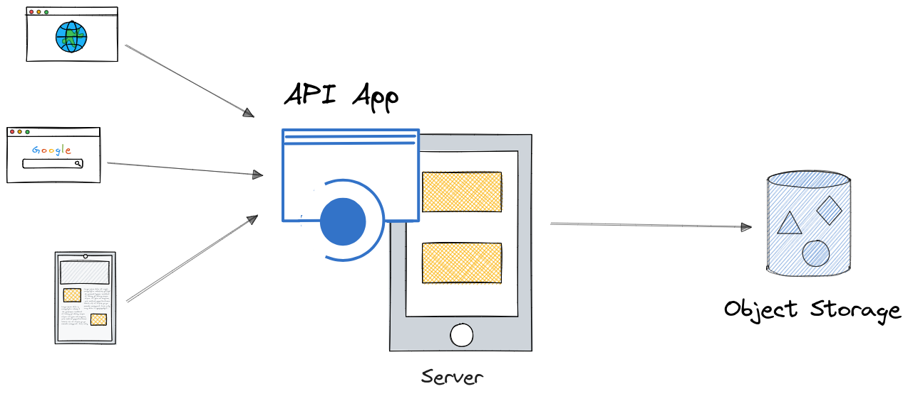
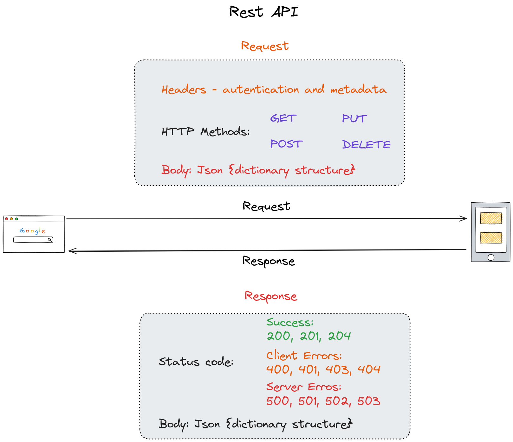
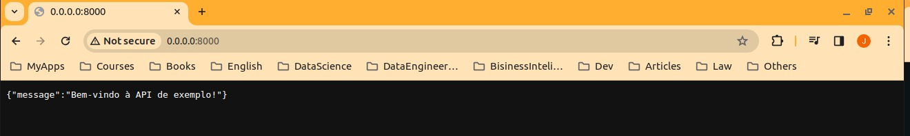
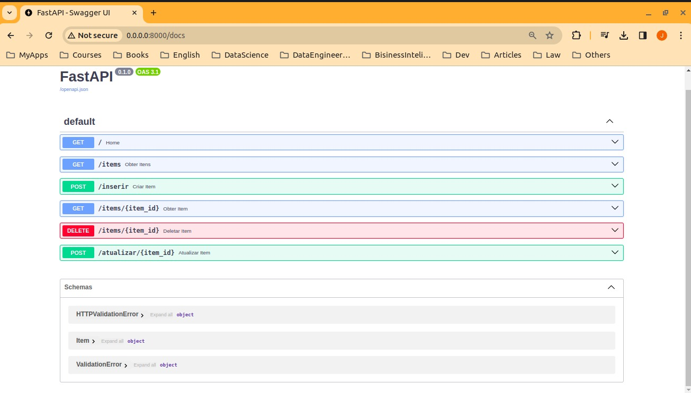

## MLOps 101 Course

---

### Building an API with Python FastAPI

#### What is an API?

APIs (Application Programming Interface) are systems (software) that facilitate communication between two or more software applications. Therefore, an API serves as a connecting bridge between one system and another. In general, a backend software loads and transforms data, making it available for other systems. On the other end, a frontend application or any other application expects to receive the processed data. An API, through a set of definitions and protocols, enables these systems to share information. This means that the frontend software can make requests to obtain data, and vice versa, it can make requests to the backend to process certain activities.



A rest API comprises a client and a server. The server does not store states, meaning it has no memory. If the same request is made two or more times, the app consults the server to get the response. In general, an API is composed of a request and a response. Headers, HTTP methods and a body with requested parameters in a JSON format compost the request. The response is composed of a status code that defines if the request occurred without problems or if some issues were found. When the request is satisfied, the response contains a body with the data information requested. 



#### Python FastAPI

FastAPI is a web framework for building APIs suing Python. The key features of this framework include (This key are presented in [FastAPI-Documentation](https://fastapi.tiangolo.com/)):

- Fast: Demonstrates very high performance, comparable to NodeJS and Go.

- Fast to code: Accelerates feature development speed.

- Fewer bugs: Results in a reduction of around 40% in human-induced errors, enhancing overall code reliability.

- Intuitive: Offers excellent editor support with comprehensive autocompletion, reducing time spent on debugging.

- Easy: Specifically designed to be user-friendly and easy to learn, minimizing the time developers spend reading documentation.

- Short: Aims to minimize code duplication, providing multiple features with each parameter declaration and ultimately reducing the occurrence of bugs.

- Robust: Generates production-ready code, accompanied by automatic interactive documentation for enhanced reliability.

- Standards-based: Aligns with and fully supports open standards for APIs, namely OpenAPI (formerly known as Swagger) and JSON Schema, ensuring compatibility and adherence to established norms.

#### Building an API

We can create a new project with poetry to management our app.

```
# project root directory
poetry init
```

- Installing dependencies:

```
poetry add fastapi uvicorn
```

Uvicorn is an ASGI (Asynchronous Server Gateway Interface) web server implementation for Python.

- How to build an API with Python FastAPI?

To build an API we need to create a database (this time we are using sqlite3 database, by default) or use an existent. 

``` python
import sqlite3
from typing import List

import uvicorn
from fastapi import FastAPI
from pydantic import BaseModel
```
An API is a standard model.  For this We can use the `pydntic` library to create a standard model and set validations. To build this model We go create a class as object model with some pre configured parameters.

```python
# Set the data model - if a request doesn't attend this model, then the response output will be failled.  
class Item(BaseModel):
    id: int
    nome: str
    preco: float
```

Next We can create a FastAPI application (in this case We are creating a simple server) with:

```python
# Create FastAPI application
app = FastAPI()
```
As we are using SQLite3, we need to create a database and a table here, from which our API will make requests or obtain responses. In a real project, this database probably already exists; we would need to create some tables for authentication.

```python
def criar_banco_de_dados():
    """Criar banco de dados e tabela"""
    conn = sqlite3.connect("database.db")
    cursor = conn.cursor()
    cursor.execute(
        """
        CREATE TABLE IF NOT EXISTS items (
            id INTEGER PRIMARY KEY AUTOINCREMENT,
            nome TEXT NOT NULL,
            preco REAL NOT NULL
        )
    """
    )
    conn.commit()
    conn.close()
```

In the next step, We create a function to connect with the database.

```python
def criar_conexao():
    """Criar conexão com o banco de dados"""
    conn = sqlite3.connect("database.db", check_same_thread=False)
    cursor = conn.cursor()
    return conn, cursor
```

An API can serve several purposes. Several different methods use different paths with their respective actions. In the FastAPI module, decorators are used to extend the functionality of a function. Therefore, for each decorator, different actions occur.

The `@app.get` decorator indicates that this method will be invoked with a get request.

```python
@app.get("/")
def home():
    return {"message": "Welcome to API root!"}
```

An API is composed of different routes, and each route has specific request parameters and specific responses. The following route or endpoint will list all items stored in the dataset.

```python
# Rotas da API
@app.get("/items", response_model=List[Item])
def obter_itens():
    """
    Obter todos os itens do banco de dados
    Returns:
      List(Item): Lista de itens
    """
    conn, cursor = criar_conexao()
    cursor.execute("SELECT * FROM items")
    items = cursor.fetchall()
    items = [Item(id=item[0], nome=item[1], preco=item[2]) for item in items]
    return items
```

The POST method will insert or update a new item in our dataset. To this endpoint an insert was set. 

```python
@app.post("/inserir", response_model=Item)
def criar_item(item: Item):
    """Criar um novo item no banco de dados

    Args:
        item (Item): Item a ser criado

    Returns:
        Item: Item criado
    """
    conn, cursor = criar_conexao()
    cursor.execute(
        "INSERT INTO items (nome, preco) VALUES (?, ?)", (item.nome, item.preco)
    )
    conn.commit()
    item.id = cursor.lastrowid
    return item
```

The GET method to items When an id is input, returns all attributes to the id. 

```python
@app.get("/items/{item_id}", response_model=Item)
def obter_item(item_id: int):
    """Obter um item do banco de dados

    Args:
        item_id (int): ID do item

    Returns:
        Item: Item obtido
    """
    conn, cursor = criar_conexao()
    cursor.execute("SELECT * FROM items WHERE id = ?", (item_id,))
    item = cursor.fetchone()
    item = Item(id=item[0], nome=item[1], preco=item[2])
    return item
```

The parameter  `response_model=Item` is used by `pydentic` (to the API), forcing the data type (from method) to the type set in the Item class.

In the `atualizar` endpoint an update is realized to an specific id.

```python
@app.post("/atualizar/{item_id}", response_model=Item)
def atualizar_item(item_id: int, item: Item):
    """Atualizar um item do banco de dados

    Args:
        item_id (int): ID do item
        item (Item): Item com os dados atualizados

    Returns:
        Item: Item atualizado
    """
    conn, cursor = criar_conexao()
    cursor.execute(
        "UPDATE items SET nome = ?, preco = ? WHERE id = ?",
        (item.nome, item.preco, item_id),
    )
    conn.commit()
    item.id = item_id
    return item
```

The `delete` decorator will exclude an item to the input id.  

```python
@app.delete("/items/{item_id}")
def deletar_item(item_id: int):
    """Deletar um item do banco de dados

    Args:
        item_id (int): ID do item

    Returns:
        _type_: Mensagem de sucesso
    """
    conn, cursor = criar_conexao()
    cursor.execute("DELETE FROM items WHERE id = ?", (item_id,))
    conn.commit()
    return {"message": f"Item {item_id} deletado"}
```

The `uvicorn` will create a server with the API created using FastAPI.

```python
# app execution
if __name__ == "__main__":
    criar_banco_de_dados()
    uvicorn.run(app, host="0.0.0.0", port=8000)
```

Config a justfile to run this app.

```
shell:
    poetry shell
api:
    poetry run python3 examples/api/api_data_source.py
```

And run this app with:

```
just api
```


FastAPI automatically generates swagger standard documentation for each API created.



### cURL Examples to interact with the API

Here are some examples of how to use cURL to interact with the server.

- Examples for the Product Server
Get All Items:

```bash
Copy code
curl -X GET "http://localhost:8000/items"
```

- Get a Specific Item:
```bash
Copy code
curl -X GET "http://localhost:8000/items/1"
```
Replace 1 with the actual ID of the item you want to retrieve.

- Create a New Item:

```bash
Copy code
curl -X POST "http://localhost:8000/insert" -H "Content-Type: application/json" -d '{"id": 0, "name": "New Item", "price": 19.99}'
```
Adjust the JSON payload as needed.

- Update an Existing Item:

```bash
Copy code
curl -X POST "http://localhost:8000/update/1" -H "Content-Type: application/json" -d '{"id": 1, "name": "Updated Item", "price": 29.99}'
```
Replace 1 with the actual ID of the item you want to update, and adjust the JSON payload as needed.

- Delete an Item:

```bash
Copy code
curl -X DELETE "http://localhost:8000/items/1"
```
Replace 1 with the actual ID of the item you want to delete.

- Examples for Text Sentiment Analysis

  - Sentiment Prediction Without Authentication:

```bash
Copy code
curl -X POST "http://localhost:8000/prediction/" -H "Content-Type: application/json" -d '{"text": "I love my dog"}'
```
  - Sentiment Prediction With Body Authentication:

```bash
Copy code
curl -X POST "http://localhost:8000/prediction_with_auth/" -H "Content-Type: application/json" -d '{"token": "password123", "text": "I love my dog"}'
``` 
Replace "TextToClassify" with the text you want to classify.

Note that in this example, the authentication token is "password123." Make sure to use the correct token if you changed the value in the code.

  - Sentiment Prediction With Header Authentication:

```bash
Copy code
curl -X POST "http://localhost:8000/prediction_with_auth/" -H "Content-Type: application/json" -H "Authorization: Bearer password123" -d '{"token": "password123", "text": "I love my dog"}'
```
Note that in this example, the authentication token is "password123." Make sure to use the correct token if you changed the value in the code.