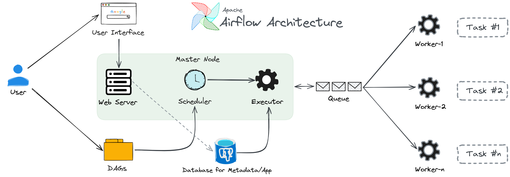

# A Review of Airflow

- **Definition**: 
Apache Airflow is a platform for developing, scheduling, and monitoring batch-oriented workflows (a finite set of activities within a specified time). Airflow is a Python framework that enables the construction of workflows by virtually connecting any technology.

## Features of Using Airflow

### Key Advantages

- Implementation of comprehensive and complex pipelines using Python code.
- Versioning.
- Easy integration with other systems due to the community.
- Rich options for scheduling.
    - Incremental processing.
    - Cost reduction.
- Backfilling to reprocess historical data.
- Web interface for Monitoring and Debugging.
- Open Source and APIs.

### Building the First DAG

```python
from airflow import DAG
import airflow.utils.dates
from airflow.operators.bash import BashOperator

dag = DAG(
    dag_id="first-dag",
    description="The first Airflow DAG to test installation",
    start_date=airflow.utils.dates.days_ago(14),
    schedule_interval="@daily"
)

task_echo_message = BashOperator(
    task_id="echo_message",
    bash_command="echo Hello World",
    dag=dag
)

task_echo_message
```

## Airflow Command Line Interface

```bash
# Connecting to the container.
docker container exec -it airflow bash

# Listing available commands.
airflow --help

# Checking environment information.
airflow info

# Checking configurations.
airflow config list

# Checking environment connections.
airflow connections list

# Listing available DAGs.
airflow dags list

# Listing tasks of a specific DAG.
airflow tasks list <dag-id>
airflow tasks list hello_world

# Testing the execution of a specific task. to execute in real <run>
airflow <tasks> <test> <dag_id> <task_id> <execution-date>
airflow tasks test hello_world echo_message 2021-07-01
```

## Airflow Architecture



### Scheduler/Executor

Monitors all DAGs and Tasks and Launches the command to execution when the dependencies are complete. According to Airflow documentation, the scheduler monitors the DAG directory and stays in sync with all DAGs. To perform this, the scheduler creates a subprocess.


### Web Interface/Server

This permits an easy integration with Airflow Dags. We Can see the state, take durations, and more in the interface.

### Database

Stores details about DAGs, Xcoms, executions and more.


### DAGs

A **DAG** (Directly acyclic graph) consists of tasks that can be of three types.
- Operators are predefined tasks that are grouped from the execution of the DAG.
- Sensors are a particular subclass of Operators that work by waiting for an external event to occur.
- Taskflow is a custom Python function packaged as a Task.


More about DAGs - Airflow Core.
- Gathers tasks together.
- Specifies their dependencies and relationships.
- Defines how and when they will be executed.

Declaring a DAG.

```python
#Through a Context manager.
with DAG("etl-db-production") as dag:
    op = DummyOperator(task_id="task")

#Through a default constructor.
my_dag = DAG("etl-db-production")
op = DummyOperator(task_id="task", dag=my_dag)

#Through a decorator - turns a function into a DAG.
@dag(start_date=days_ago(2))
def generate_dag():
    op = DummyOperator(task_id="task")
dag = generate_dag()

```

### Running DAGs

DAGs are executed in two ways.
- Manual triggering or via API.
- Scheduling interval.
    - `with DAG("etl-db-production", schedule_interval="@daily"):`
    - `with DAG("etl-db-production", schedule_interval="0 * * * *"):`
- Default arguments
```python
default_args = {
    'start_date': datetime(2016, 1, 1),
    'owner': 'airflow'
    }
with DAG('etl-db-production', default_args = default_args) as dag:
    op = DummyOperator(task_id='dummy')
print(op.owner)
```

### Control Flow

Tasks have dependencies between them.
- Extraction will be executed, and then a fork will be created where it can execute either the transformation or the load task `extraction >> [transformation, load]`
- The notification task depends on the load task. `load << notification`
We can define dependencies through the methods.
- `extraction.set_downstream([transformation, load])`
- `load.set_upstream(notification)`

Ways to control task execution.
- Branching: Determines which Task to move from a condition.
- Latest Only: Only runs on DAGs running at present.
- Depends on Past: Tasks may depend on themselves from a previous execution.
- Trigger Rules: Allows defining conditions for a DAG to execute a task.

### Edges Labels

We can define labels to document relationships and dependencies between tasks.
- `get_accuracy_op >> check_accuracy_op >> Label("Limit 90%") >> [deploy_op, retrain_op] >> notify_op`
- `get_accuracy_op.set_downstream(check_accuracy, Label("Metric ACC"))`

## Tasks

The most basic execution unit of Airflow.
They can be of three types.
- Operators, Sensors, and Taskflow.
The relationship is defined through dependencies (upstreams and downstreams).

- States of each Task.

    - none: The Task still needs to be queued for execution (its dependencies still need to be met).
    - scheduled: The scheduler has determined that the Task's dependencies are met and should be executed.
    - queued: The Task has been assigned to an executor and is waiting for a worker.
    - running: the Task is executed on a worker (or a local/synchronous executor).
    - success: The Task finished running without error.
    - failed: the Task had an error during execution and failed to run.
    - skipped: The Task was skipped due to branching, LatestOnly, or similar.
    - upstream_failed: an upstream task failed, and the trigger rule says we needed it.
    - up_for_retry: The Task failed, but new attempts remain, and it will be rescheduled.
    - up_for_reschedule: The Task is a Sensor that is in rescheduling mode.
    - sensing: The Task is an intelligent sensor
    - removed: The Task has disappeared from the DAG since the beginning of execution.

## Xcoms - Cross Communications between tasks

Data transfer between tasks.
- X-coms (Cross-communications) - push and pull metadata.
- Uploading and downloading to storage services (Databases, services, files)

## Building a Data Pipeline

Pipeline Requirements.

- Data must be separated from the OLTP environment to the OLAP environment.
- All tasks must be executed daily.
- The entire process must be notified.
- The stage environment must be cleaned.
- All logs must be kept.

- Creating a MySQL container (OLTP Server - Data Source)

OLTP, from "Online Transaction Processing", is the term used to refer to transactional systems. OLTP, or Online Transaction Processing, is a type of data processing involving executing multiple simultaneous transactions (online banking transactions, purchases, order entry, or text messaging, for example). These transactions are traditionally called economic or financial transactions, recorded and protected so that a company can access the information at any time for accounting or reporting purposes.

`docker run -d --name mysql_oltp -p "3306:3306" -v "C:\Wesley\airflow\data:/home" -e MYSQL_ROOT_PASSWORD=airflow mysql:8.0.27`

To connect to the created container

`docker container exec -it mysql_oltp`

- Creating a Postgres container (OLAP Server - Data Destination)

OLAP, from "Online Analytical Processing", deals with the ability to analyze large volumes of information from various

 Perspectives within a Data Warehouse (DW). OLAP also refers to the analytical tools used in BI for visualizing managerial information and supporting the organizational business analysis functions.

`docker run -d --name postgres_olap -p "3254:5432" -v "C:\Wesley\airflow\data:/home" -e POSTGRES_PASSWORD=airflow -d postgres`

To connect to the created container

`docker container exec -it postgres_olap`

Inside the Postgres container, to enter the database, use the following:

`psql -h localhost -U postgres`

Connect to the airflow container as a superuser:

`docker container exec -it --user root 54452a99d6acb819ba00b59bc7630f4a67a6606bded9701e8dccb1607f56d2ad bash`

### OLTP x OLAP Differences

OLTP allows real-time execution of many transactions by a large number of people. At the same time, Online Analytical Processing (OLAP) usually involves querying these transactions (also called records) in a database for analytical purposes. OLAP helps businesses extract insights from transaction data to use it in more informed decision-making.

Setting up Airflow to send Emails

Smtp service website
*mailtrap.io*

SMTP Server
- Create an account on Mailtrap.
- Configure the Airflow configuration file.

Connect to the airflow container as a superuser:

`docker container exec -it --user root 54452a99d6acb819ba00b59bc7630f4a67a6606bded9701e8dccb1607f56d2ad bash`

Installing Vim and network utility in the airflow container:

Connect to the airflow container as a superuser:

`apt-get update && apt-get install vim iputils-ping -y`

Inspect the container to get the IP